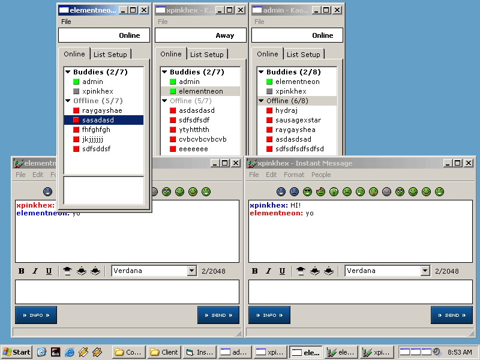



## KIM \- Kaotix Instant Messenger 1\.0

### Description

This is my entry to the "instant messenger race" that I've noticed going on and so here it is! Heres a run-down of the features: Client-server relationship, all screennames are stored in a database on the server's machine, all buddylists are also stored on the server so that you can access your buddies anywhere, nice buddylist icons ;), fast (and I mean fast), nice AIM-like interface, no encryption yet (in the next release), when you press the X button in the titlebar it hides the window and you can access it through the system tray (again like AIM), only known bug is that if the server is turned off before the clients then the list of online users must be manually cleared by a person (list is stored in database file), the main database is very easy to edit and you can use Microsoft Access to edit it manually... phew well thats just a list of the more prominent features but I spent a while working on the things that would seem awkawrd to mention in a description but you'll see what they are. They're mostly just things that make it more versitile and usuable on a daily basis. Anyway, this is the first release and more shall come. I'd like to give thanks to the two authors that worked on this project before me they got rid of alot of the hard work ;) If you have any suggestions for the program please post them below and don't forget to vote!
 
### More Info
 

             |
---                |---
**Submitted On**   |2002-02-19 08:49:14
**By**             |[neurokaotix](https://github.com/Planet-Source-Code/PSCIndex/blob/master/ByAuthor/neurokaotix.md)
**Level**          |Intermediate
**User Rating**    |4.2 (25 globes from 6 users)
**Compatibility**  |VB 3\.0, VB 4\.0 \(16\-bit\), VB 4\.0 \(32\-bit\), VB 5\.0, VB 6\.0, VB Script, ASP \(Active Server Pages\) , VBA MS Access, VBA MS Excel
**Category**       |[Internet/ HTML](https://github.com/Planet-Source-Code/PSCIndex/blob/master/ByCategory/internet-html__1-34.md)
**World**          |[Visual Basic](https://github.com/Planet-Source-Code/PSCIndex/blob/master/ByWorld/visual-basic.md)
**Archive File**   |[KIM\_\-\_Kaot561942192002\.zip](https://github.com/Planet-Source-Code/neurokaotix-kim-kaotix-instant-messenger-1-0__1-31929/archive/master.zip)

